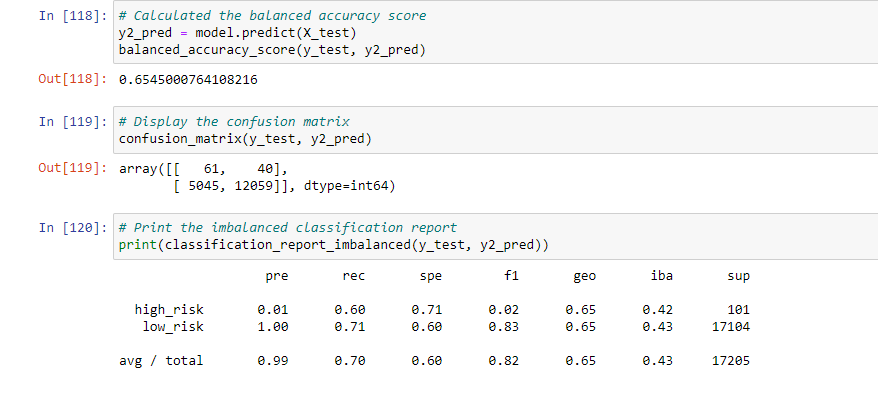
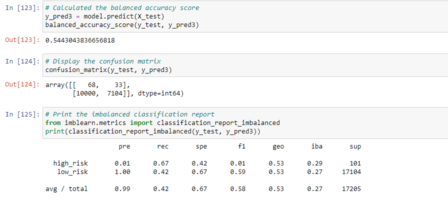

# Credit_Risk_Analysis

## Overview

 This analysis applies machine learning to evaluate credit card risk. Credit risk, being an inherently unbalanced classification problem, requires employing different techniques to train and evaluate models with unbalanced classes. Here "imbalanced-learn" and "scikit-learn" libraries  are used to build and evaluate models using resampling.

## ROS
Random Over Sampler

### Results

* Balanced-Accuracy score is not very strong at .64
* Prescion on High risk was very low at .01 while extremely high, 1.0, for low risk 
* Sensitivity on High risk was decent at .71 high lower for low risk

## SMOTE
Synthetic Minority Over-sampling Technique

### Results

* Balanced-Accuracy score is not very strong at .65
* Prescion on High risk was very low at .01 while extremely high, 1.0, for low risk 
* Sensitivity on High risk was at .60 and .71 for Low risk

## Cluster Centroids

### Results

* Balanced-Accuracy score is not very strong at .54
* Prescion on High risk was very low at .01 while extremely high, 1.0, for low risk 
* Sensitivity on High risk was at .67 and .42 for Low risk

## SMOTE_ENN
SMOTE and Edited Nearest Neighbors

### Results

* Balanced-Accuracy score is not very strong at .64
* Prescion on High risk was very low at .01 while extremely high, 1.0, for low risk 
* Sensitivity on High risk was at .72 and .57 for Low risk

## Balanced RandomForest Classifier

### Results

* Balanced-Accuracy score is decent at .77
* Prescion on High risk was very low at .03 while extremely high, 1.0, for low risk 
* Sensitivity on High risk was at .66 and .88 for Low risk

## Easy Ensemble AdaBoost Classifier

### Results

* Balanced-Accuracy score is strong at .93
* Prescion on High risk was very low at .09 while extremely high, 1.0, for low risk 
* Sensitivity on High risk was at .92 and .94 for Low risk
* with an extremely low F1 score (.06) for High risk this model isnt very good at predicting those profiles.

## Summary

The clear winner in these modeling comparisions is the Easy Ensemble AdaBoost Classifier with a balanced accuracy of .93 and High risk recall of .92. As it is most important for lenders to identify high risk borrowers this high recall minimizes the potential high risk borrowers mistakenly classified as low risk.    

